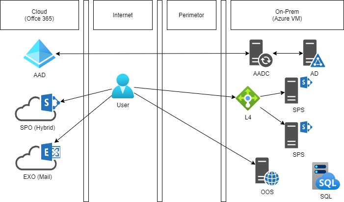

# 서비스 아키텍쳐

본 데모 시스템의 서비스 구조를 설계할 때 중점적으로 고려한 사항이 몇가지 있습니다
+ 가장 최근에 출시된 SharePoint Server SE를 사용해서 구성해 보자. SE 버전에서 추가된 신기능을 테스트 해볼 수 있으면 좋겠다.
+ Azure Cloud의 IaaS 인프라를 활용하여 구성해 보자. 단순 Azure VM을 활용하는데 그치지 않고, SharePoint 시스템을 Azure에 구성할 때 누릴 수 있는 혜택을 찾아 적용하자 (Azure SQL Managed Instance, Azure Load Balancer)
+ IaaS에 구축된 SharePoint SE 서버가 온프렘 시스템이니, Office 365 와 연동하는 시나리오에 대응하도록 하자.

그 결과로 구성된 시스템 구성도가 아래와 같습니다.

1. AD 서버가 필요합니다. SharePoint 시스템 구성을 위해서 필수적으로 필요합니다.
>>> 이 데모 시스템 구성에 사용된 서버들은 모두 AD 도메인에 가입되어야 합니다.
3. SQL 서버가 필요합니다. 이 또한 SharePoint 시스템을 위해 필수적으로 필요합니다. 본 데모에서는 Azure VM에 SQL 서버를 설치하는 것이 아닌, Azure SQL Managed Instance 를 사용하였습니다. VM으로 구성하는 것보다 Managed Instance 가 성능적인 잇점을 누릴 수 있어서 선택하였습니다.
> 실제로 구축하는 작업에서 일반적인 SQL 서버에서 작업하는 것과는 달리, 모든 SQL 관련 작업을 파워쉘 스크립트로만 진행해야 했습니다. 중앙관리 사이트의 웹 UI를 선호하시는 분들에게는 약간의 번거로움이 있을 수 있습니다. 
> 이후의 운영단계에서도 많은 작업이 파워쉘을 통해서 진행해야만 합니다. (서비스 응용프로그램 관리, 웹 응용프로그램 관리)
4. 쉐어포인트 서버는 웹프론트 2대, 백엔드 1대 로 구성합니다. 테스트를 위한 최소구성 예입니다.
5. 웹프론트엔드 서버 2대 앞에 L4 스위치 역할을 하는 Azure Load Balancer 를 두어 사용자 분산 및 고가용성 시스템을 구현합니다
> Azure 에서 이용도로 사용할 수 있는 서비스가 두가지 입니다.
> - Azure Load Balancer - Layer 4 트래픽에 대응합니다. L4 스위칭 장비라고 보시면 됩니다.
> - Azure Application Gateway - Layer 7 트래픽에 대응합니다. L7 스위칭 장비라고 보시면 됩니다.
6. OOS 는 Office Online Server를 의미합니다. 웹오피스 기능을 제공합니다.
> 일반적인 운영환경이라면 OOS 서버도 이중화하여 L4 스위치를 붙이는 것이 필요합니다. 데모환경이므로 생략하였습니다.
> 원칙적으로 OOS 서버는 Azure나 AWS와 같은 공유된 IaaS 시스템에서 사용이 허용되지 않습니다. 여기에서는 데모용도로만 사용하였습니다.
> 참조 [Office Web Apps and Office Online Server supportability in Azure and other IaaS providers] (https://support.microsoft.com/en-us/office/office-web-apps-and-office-online-server-supportability-in-azure-and-other-iaas-providers-61eb97b6-f83e-4852-bfe8-727b52d884dd)
7. AADC 는 Azure Active Directory Connect 입니다. 이 서버를 통해 온프렘 AD의 계정을 Office 365로 동기화 합니다.
