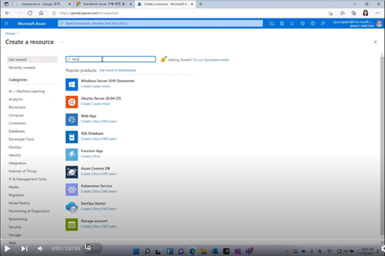
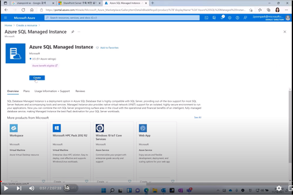
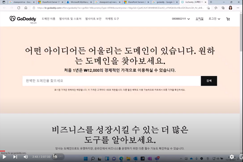
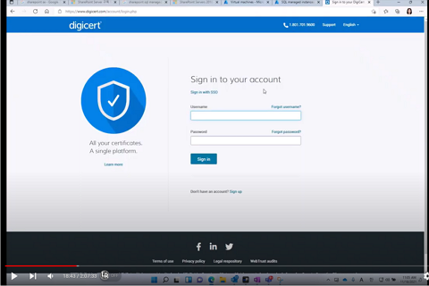

# 1. 준비

### 1. Virtual Network 준비   
 [동영상 링크](https://youtu.be/PJH9Eef2Oec)   

### 2. Azure SQL Database Managed Instance 생성
 [동영상 링크](https://youtu.be/PJH9Eef2Oec?t=51)

### 3. 인터넷 도메인 준비
 [동영상 링크](https://youtu.be/PJH9Eef2Oec?t=162)

### 4. Azure Virtual Machine 생성
 [동영상 링크](https://youtu.be/PJH9Eef2Oec?t=212)

### 5. AD 도메인 콘트롤러 설치
 [동영상 링크](https://youtu.be/PJH9Eef2Oec?t=477)

### 6. AD 도메인 서버 조인
 [동영상 링크](https://youtu.be/PJH9Eef2Oec?t=624)

### 6. Digicert 인증서 준비
 [동영상 링크](https://youtu.be/PJH9Eef2Oec?t=1124)
