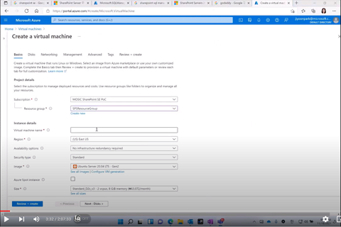
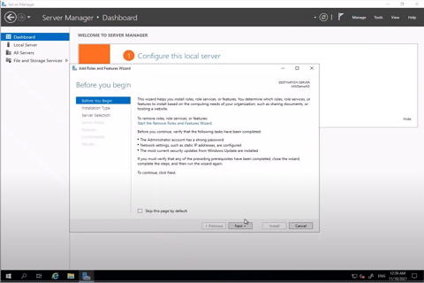
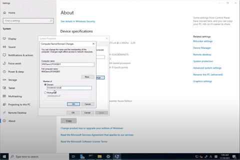

# 1. 준비

### 1. Virtual Network 준비   
 [동영상 링크](https://youtu.be/a_ezFu8nmE8?t=3)   

### 2. Azure SQL Database Managed Instance 생성
 [동영상 링크](https://youtu.be/a_ezFu8nmE8?t=408)

### 3. 인터넷 도메인 준비
 [동영상 링크](https://youtu.be/a_ezFu8nmE8?t=610)

### 4. Azure Virtual Machine 생성
 [동영상 링크](https://youtu.be/a_ezFu8nmE8?t=772)

### 5. AD 도메인 콘트롤러 설치
 [동영상 링크](https://youtu.be/a_ezFu8nmE8?t=1783)

### 6. AD 도메인 서버 조인
 [동영상 링크](https://youtu.be/a_ezFu8nmE8?t=2373)

### 7. Digicert 인증서 준비
 [동영상 링크](https://youtu.be/a_ezFu8nmE8?t=4353)
