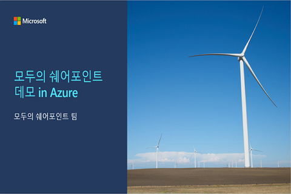

# 모두의 쉐어포인트 데모 in Azure
이 페이지는 Azure IaaS 환경에 쉐어포인트 서버 환경을 구축하고자 하는 분들에게 도움이 될 수 있는 내용을 전달하기 위해 만들어 졌습니다.

### [소개 동영상 보기 << 클릭!!](https://youtu.be/bmqh04-VXiE)   

## 데모환경 요구사항
1. [요구사항](1.Requirements)

## 아키텍쳐 설계
1. [서비스 아키텍쳐](2.Architecture/Architecture_Service.md)
2. [하드웨어&소프트웨어 아키텍쳐](2.Architecture/Architecture_Hardware.md)
3. [네트워크 아키텍쳐](2.Architecture/Architecture_Network.md)

## 데모환경 구성작업
1. [준비](3.Deployments/1.Preparations.md)
2. [SharePoint Server 설치](3.Deployments/2.Installation.md)
3. [SharePoint Server Farm 구성](3.Deployments/3.Configuration.md)
4. [SharePoint Hybrid 구성](3.Deployments/4.Hybrid.md)
5. [웹서버 로드밸런싱 구성](3.Deployments/5.LoadBalancer.md)

## 사용도구
* VSCODE
* mRemoteNG
* https://code.visualstudio.com/blogs/2021/06/10/remote-repositories 
* https://app.diagrams.net/ 
